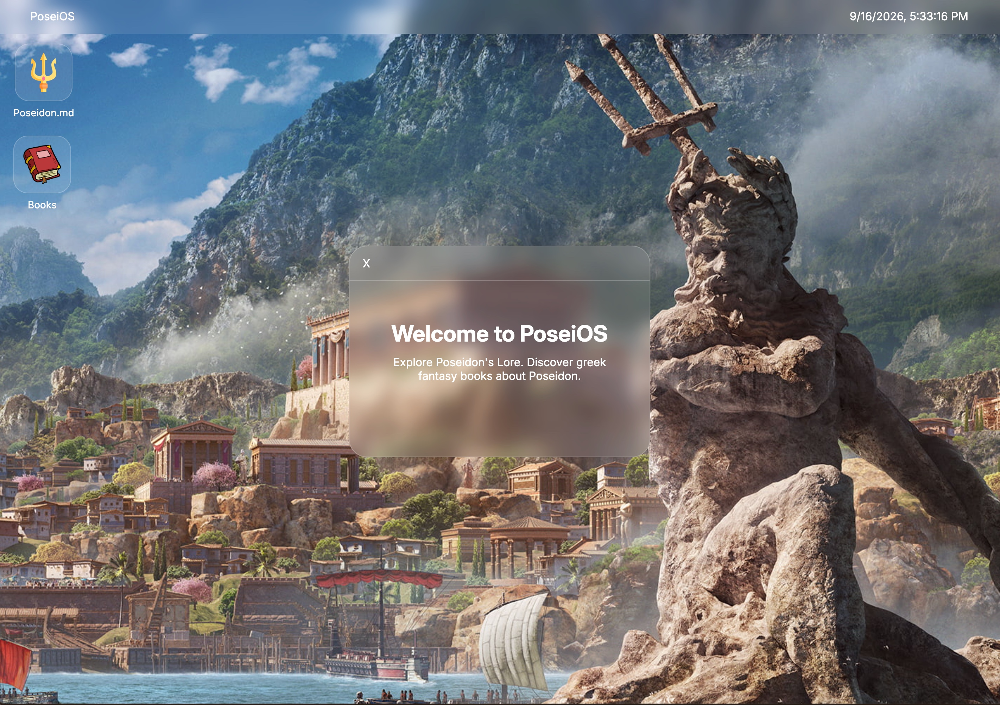

<div align="center" >

# PoseiOS 🔱



**A Poseidon-themed Operating System that runs directly in the browser.**


Made for Hack Club Stardance

</div>

---

### Tech Stack & Attributions

| Function          | Framework  |
| :---------------- | :--------: |
| Framework         |    HTML    |
| Styling           |    CSS     |
| Scripts           | Javascript |
| App Icons         |  Magnific  |
| Background Images |   Google   |

### Getting Started

```
Clone the repo using git clone


```

### Deployment

PoseiOS is deployed using Vercel, but it could also work through
similar services like Netlify and Github Pages.
